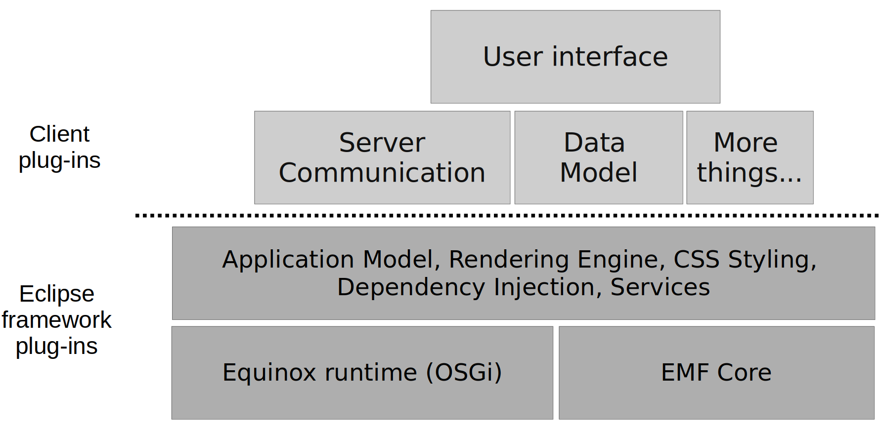

1. ### Introduction:

Eclipse RCP (Rich Client Platform) applications, use the Eclipse framework to create feature-rich stand-alone desktop applications. 
An Eclipse application consists of individual software components, called plug-ins. Plug-ins can use and extend other plug-ins. For example, a plug-in can create new menu entries for a menu defined by another plug-in. 
The Eclipse IDE can be viewed as a special Eclipse RCP application with the focus on supporting software development. For example, the Java development tools (JDT) provide the functionality to develop Java applications. 
An Eclipse RCP application typically uses the same base components as the Eclipse IDE. On top of these, the developer of the RCP client add application specific components. This is depicted in the following graphic.

2. ### Package Description:

A complete set of tools for developers who want to create Eclipse plug-ins, Rich Client Applications or Remote Application Platform (RCP+RAP), plus Maven and Gradle tooling, and an XML editor. It contains the EGit tooling for accessing Git version control systems, and Eclipse Passage which helps with license management for Eclipse-based products. 
This package includes: 
Git integration for Eclipse  
Eclipse Java Development Tools  
Maven Integration for Eclipse  
Eclipse Plug-in Development Environment  
Remote Application Platform  
Eclipse XML Editors and Tools  

An Eclipse RCP application typically uses the same base components as the Eclipse IDE. On top of these, the developer of the RCP client add application specific components. This is depicted in the following graphic.

   

3. ### What is  OSGi:
  
 
  OSGi stand for Open Service Gateway Initiative. It is a modular approach and specification that allows developers to create robust, highly decoupled and dynamic applications in Java. There are various implementations of this specification. The open source options include Apache Felix, Eclipse Equinox and Knopflerfish. 
  
  

4. ### References:
  
* [More Information Regarding OSGI](https://www.osgi.org/resources/what-is-osgi)

